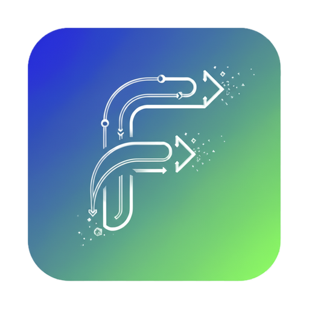

# flow hub

基于 Tauri 2.0 的多 Agent 桌面工作台，当前重点是 iFlow ACP 协议接入、历史会话管理与可视化交互。



## 近期功能更新

- 设置页：将重连方式、提醒延迟、通知音、主题切换集中到 `设置` 弹窗，减少顶部按钮拥挤
- 刷新后重连：支持 `最后一个 / 全部 / 关闭` 三种策略，并支持命令与 UI 双入口配置
- 重连容错：Agent 非在线状态下均可手动重连，避免连接异常后无法恢复
- 文件变更面板：改为手动打开，不再在普通聊天过程中自动弹出
- 通知音更新：内置 8 个短提示音，命名简化为 `铃声01 ~ 铃声08`

## 核心能力

- iFlow Agent 管理：新增、重连、重命名、删除
- 模型管理：显示当前模型、拉取模型列表、点击切换
- 会话管理：多会话、会话标题、会话持久化
- iFlow 历史导入：按 Agent 工作目录读取 `~/.iflow/projects/-<workspace-key>/session-*.jsonl`
- 会话删除落盘：删除单条会话或清除当前 Agent 会话时，真实删除对应历史文件
- 消息渲染：Markdown（含表格、代码块、链接、图片）与 `<Think>` 思考块
- 工具调用面板：多条调用增量展示，状态与参数/输出可追踪
- 文件变更面板：支持手动查看工作区 Git 变更与 diff 预览
- HTML Artifact 预览：识别 `.html/.htm` 路径并弹窗预览，支持中文文件名
- 设置中心：支持刷新后重连方式、提示音与主题切换
- 发送交互：发送按钮在生成中切换为停止按钮（ACP `session/cancel`）
- 快捷回复：`继续`、`好的`、重试上一问

## 技术栈

- Frontend: TypeScript + Vite
- Desktop: Tauri 2.0
- Backend: Rust + Tokio + tokio-tungstenite

## 目录结构

```text
iflow-workspace/
├── src/                 # 前端 TS 与样式
├── src-tauri/           # Rust 后端与 Tauri 配置
├── CHANGELOG.md
├── README.md
└── package.json
```

## 本地开发

### 前置条件

- 安装 iFlow CLI：`https://cli.iflow.cn/`
- 确保可执行：`iflow --help`

### 安装依赖

```bash
npm install
```

### 启动（推荐）

```bash
npm run tauri:dev
```

默认前端地址：`http://localhost:1420`

### 仅启动前端

```bash
npm run dev
```

## 构建

```bash
npm run build
npm run tauri:build
```

## 检查

```bash
cd src-tauri
cargo check
```
